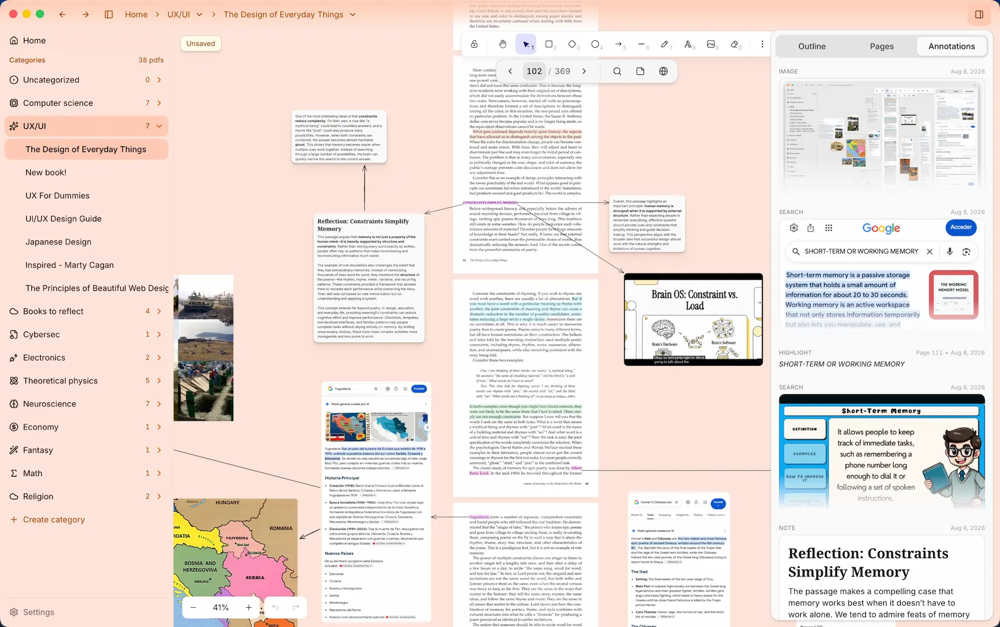
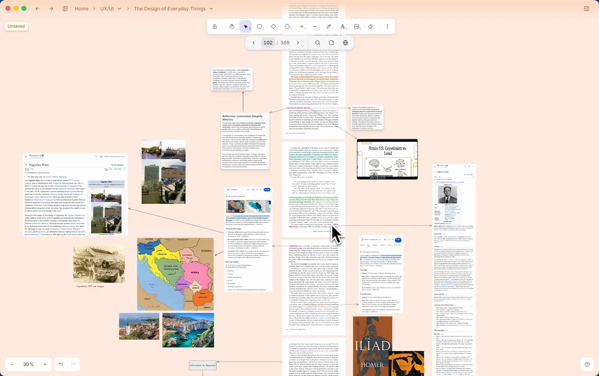
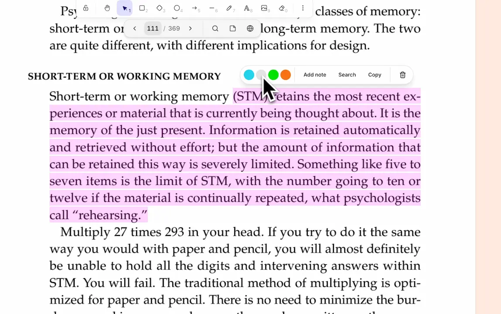
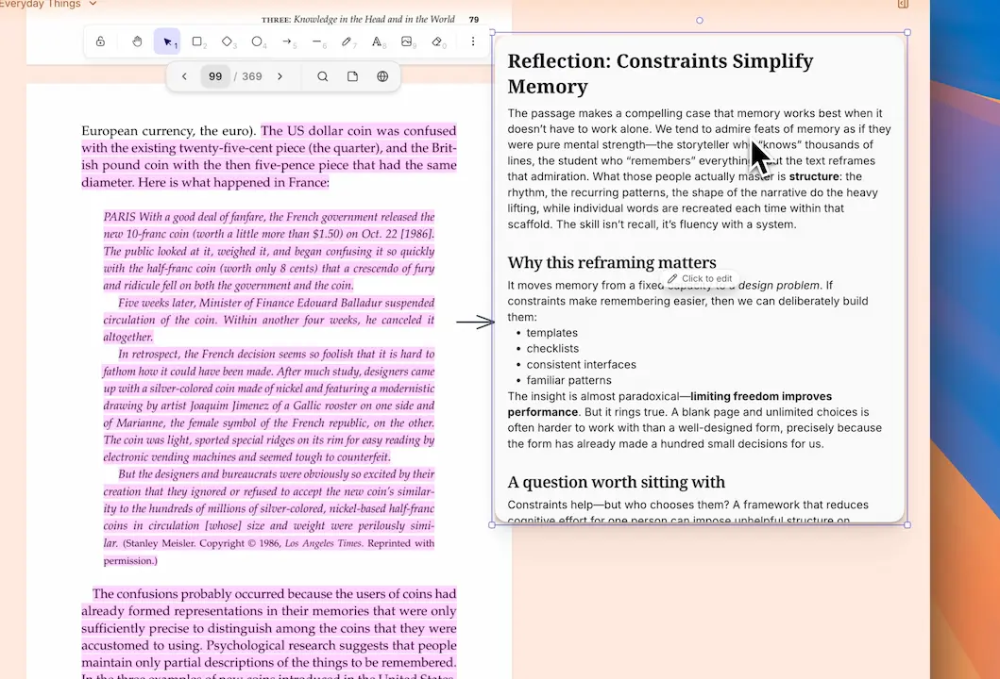
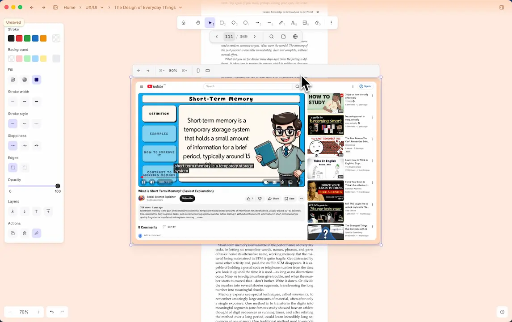
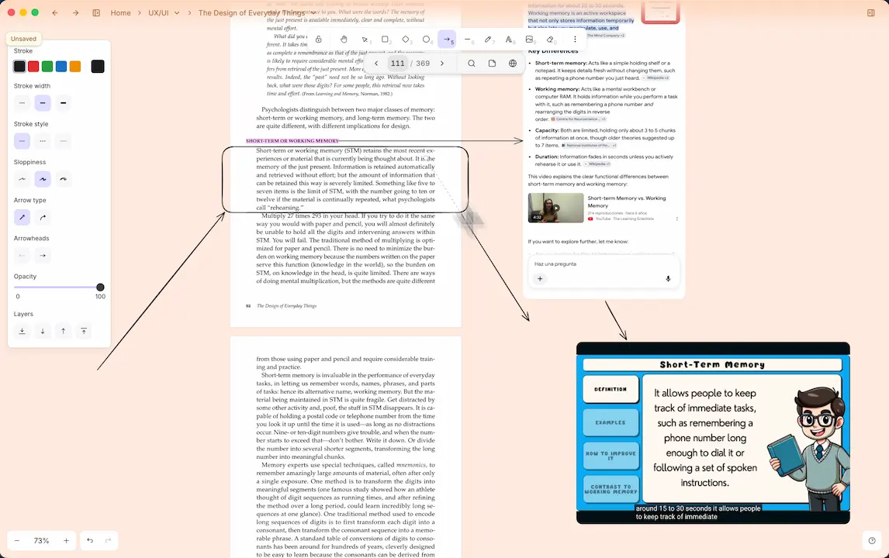
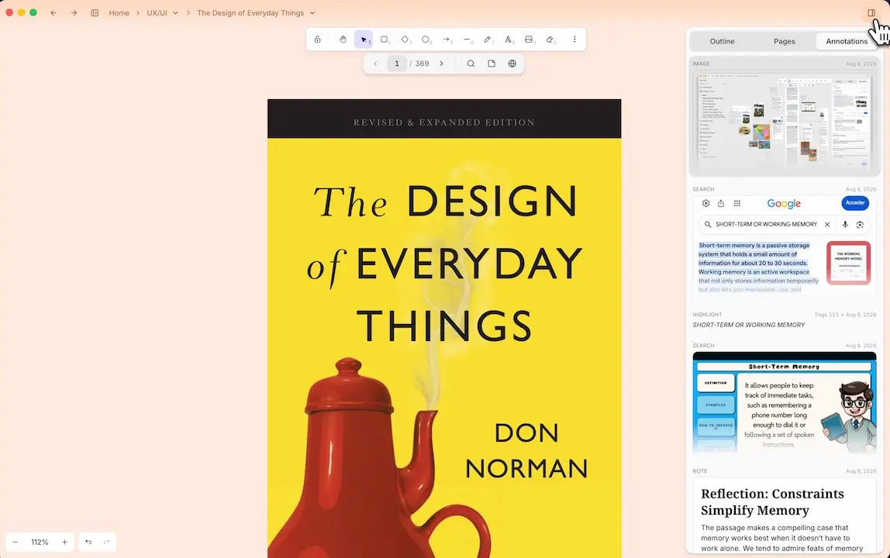
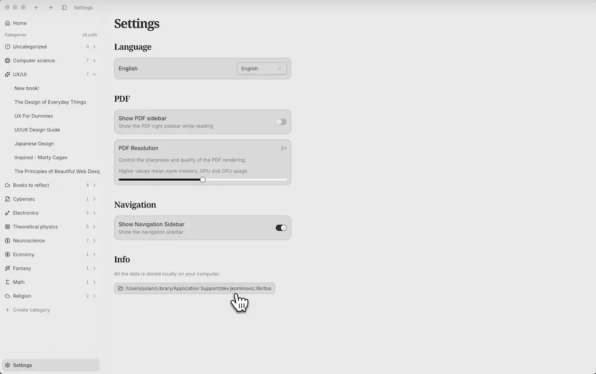

<p align="center"></p>
<h1 align="center">Libritus</h1>
<p align="center">
  <strong>Desktop research workspace.</strong> Read PDFs on an infinite canvas — and keep the
  investigation (notes, highlights, diagrams, web searches) on that canvas so you can follow your
  reasoning later. AI answers only when you ask; it never auto-summarizes or underlines for you.
</p>

<p align="center">
  <a href="#features">Features</a> · <a href="#research-canvas">Research canvas</a> · <a href="#download-macos">Download</a> · <a href="#development">Development</a> · <a href="#license">License</a>
</p>

<p align="center">
  
</p>

> **Stop reading. Start thinking.** Vertical scroll is a cage. Work on an infinite whiteboard
> instead: notes, diagrams, and web searches live on the same scene as the text. For students,
> researchers, and curious readers who refuse to outsource thinking to AI.

## Features

### Infinite PDF canvas

Pan and zoom virtualized pages on a whiteboard, rendered by PDFium. The document is the axis; the space around it is yours. Large PDFs stay fluid.

<p></p>

### Highlights from selection

Select text and lock a highlight onto the canvas. Color it, copy the text, or grow a note or web search from it.

<p></p>

### WYSIWYG notes

Drop a rich note anywhere, or grow one from a highlight. It sits next to the passage that sparked it.

<p></p>

### Web search capture

Search from a highlight, place a browser, or paste or drop a link onto the canvas. Browse in-app, then pin a screenshot beside the text.

<p></p>

### Freehand and diagrams

Arrows, shapes, and sketches with Excalidraw tools, drawn on top of the PDF.

<p></p>

### Outline, thumbnails, annotations

Jump via outline, page thumbnails, or a list of your highlights, notes, captures, and canvas images. The sidebar finds your place; research stays on the canvas.

<p></p>

### Sessions that persist

Camera and annotations autosave per PDF. Come back and continue where you stopped. Everything stays on your machine — fully offline.

<p></p>

## Research canvas

The PDF viewer is an **infinite canvas** (Excalidraw + EmbedPDF / PDFium): virtualized pages, free pan/zoom, and freeform research on top of the document. Product north, architecture, roadmap, and agent conventions:

- [`docs/features/product-north.md`](docs/features/product-north.md) — research canvas premises (canvas owns research; AI subordinate)
- [`docs/architecture/infinite-pdf-canvas.md`](docs/architecture/infinite-pdf-canvas.md) — vision and architecture
- [`docs/roadmap.md`](docs/roadmap.md) — v1 → v2 path, research-on-canvas debt, legacy migration
- [`AGENTS.md`](AGENTS.md) — operational ground truth for contributors and agents

The previous lector-based vertical reader has been removed; the canvas viewer is the only PDF path.

## Follow the journey!

Progress notes: https://jkominovic.dev

## Download (macOS)

Grab the latest `.dmg` from [Releases](https://github.com/JulianKominovic/libritus/releases) (Apple Silicon: `*-mac-arm64-setup.dmg`), open it, and drag **Libritus** into Applications.

macOS may say the app is **damaged** and offer to move it to the Trash. That is Gatekeeper blocking an unsigned build — the app is fine. In Terminal:

```bash
xattr -cr /Applications/Libritus.app
```

Then open Libritus again. (Right-click → Open, or **System Settings → Privacy & Security → Open Anyway**, can also work.)

## Development

```bash
git clone git@github.com:JulianKominovic/libritus.git
cd libritus
bun install
bun run dev
```

Packaged mac build:

```bash
bun run build:mac
```

## License

[Attribution-NonCommercial-ShareAlike 4.0 International (CC-BY-NC-SA-4.0)](LICENSE). Non-commercial use only — a personal open-source project, shared openly.

## Mascot


